# AWS API Gateway Configuration with Lambda, Mock, and SNS Integration

## Overview

This project involves the setup of an AWS API Gateway REST API, featuring various endpoints that include Mock, Lambda, and AWS service (SNS) integrations.

To better understand the distinctions between REST and HTTP APIs, refer to the AWS documentation available at [https://docs.aws.amazon.com/apigateway/latest/developerguide/http-api-vs-rest.html](https://docs.aws.amazon.com/apigateway/latest/developerguide/http-api-vs-rest.html).

For the purposes of this demonstration, REST will be employed due to its compatibility with Mock integrations.

Please note that the configuration is tailored for the us-east-1 region. Adjust the region accordingly if deploying elsewhere.

## Instructions

### Stage 1 - Setting up SNS

1. Navigate to the SNS console in the ap-southeast-2 region: [https://us-east-1.console.aws.amazon.com/sns/v3/home?region=us-east-1#/topics](https://us-east-1.console.aws.amazon.com/sns/v3/home?region=us-east-1#/topics).

2. Click on <kbd>Create topic</kbd>.

3. Configure the following settings:
   - Set the *Type* to "Standard."
   - Name the topic as "API-Messages."
   - Under *Access policy*, select *Method* as "Basic."
   - Set *Define who can publish messages to the topic* to "Only the specified AWS accounts" and input your account ID (located in the top right of the console).
   - Set *Define who can subscribe to this topic* to "Only the specified AWS accounts" and enter your account ID again.
   - For the purpose of this example, it is acceptable to leave other options as default.

4. Click on <kbd>Create topic</kbd>.

5. On the next page, click on <kbd>Create subscription</kbd>.

6. Modify the *Protocol* to "Email."

7. In the *Endpoint* field, input your personal email.

8. Click <kbd>Create subscription</kbd>.

9. Shortly after, you will receive a confirmation email containing a link. Click on the link to confirm your subscription and signal your willingness to receive emails from the topic.

   *Note: Confirm that the confirmation email is not flagged as spam; check your spam folder if needed.*

10. Confirm that your subscription is in the Confirmed state, as depicted in the following image:

   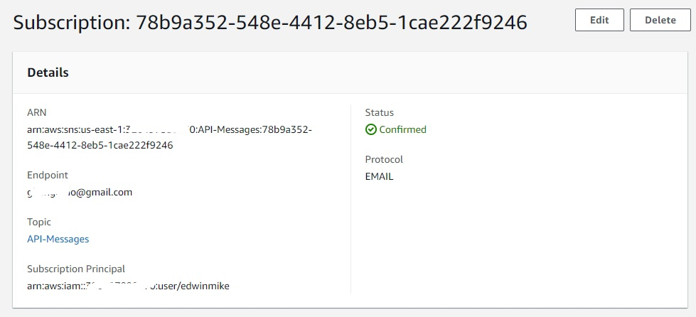

## Stage 2: Lambda Creation

### Instructions:

1. Navigate to the Lambda console by following this [link](https://us-east-1.console.aws.amazon.com/lambda/home?region=us-east-1#/functions).

2. Click on the <kbd>Create function</kbd> button.

3. Choose *Author from scratch* as the starting point.

4. Configure the function details:
   - Set *Function name* to `api-return-ip`.
   - Choose *Runtime* as "Python 3.9".
   - Leave *Architecture* as “x86_64”.

5. Click <kbd>Create function</kbd> to proceed.

6. In the *Code* tab, insert the following Python code:

```python
def lambda_handler(event, context):   
    return {
        'statusCode': 200,
        'headers': {},
        'body': event['requestContext']['identity']['sourceIp'],
        'isBase64Encoded': False
    }
```

This code defines a basic function that retrieves and returns the source IP of the requester.

7. Ensure to click <kbd>Deploy</kbd> to save the function.

8. Refer to the screenshot below for visual guidance:
   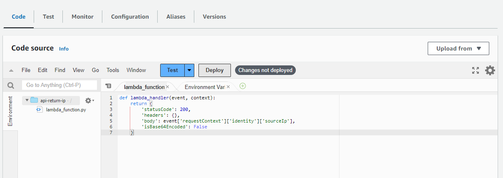

These steps guide you through creating a Lambda function named `api-return-ip` in the AWS Lambda console, written in Python 3.9. The function returns the source IP of the requester with a basic HTTP response structure. Remember to deploy the function after creation.

## Stage 3 - API Creation

To establish the API for your project, follow these steps using the AWS Management Console:

1. Navigate to the API Gateway console: [API Gateway Console](https://us-east-1.console.aws.amazon.com/apigateway/main/apis?region=us-east-1).

2. Click on <kbd>Create API</kbd>.

3. Select "REST API" and click <kbd>Build</kbd>.

4. Ensure that "REST API Private" is not selected.

   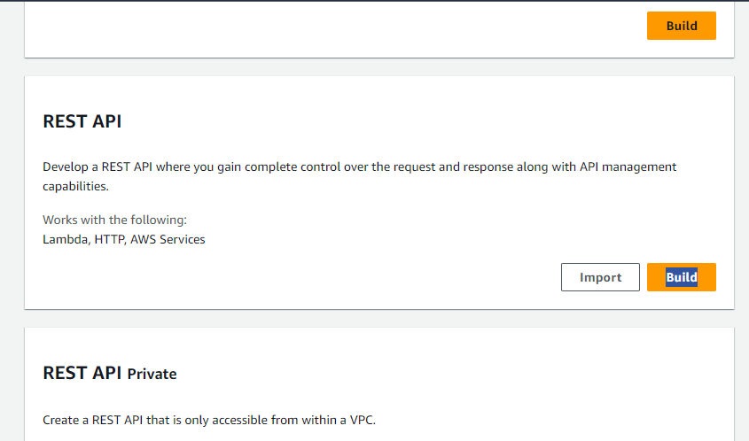

5. Keep the Protocol and "Create new API" options unchanged, and provide a name for your API.

   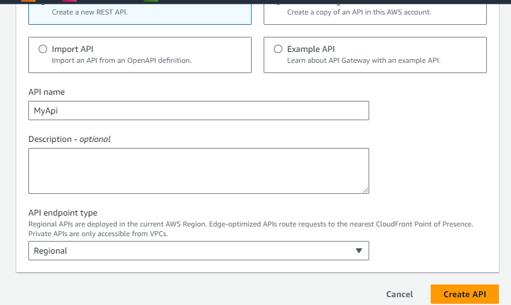

6. Click <kbd>Create API</kbd>.

7. After the API is created, you will see a list of "Resources" (endpoints/API paths). As there are currently none, click on "Create Resource."

   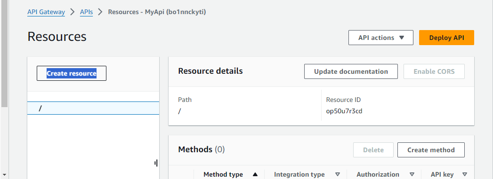

8. Create the first resource for Mock integration, naming it "Mock." The Resource Path is the URL path used to call it, such as:

   `https://abcdef1234.execute-api.us-east-1.amazonaws.com/mock`

   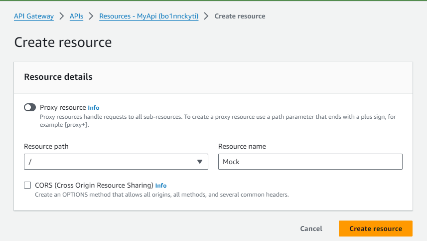

9. Attach a Method to the "/mock" resource. For the Mock integration, use "GET."

10. Click on "Create Method," and select "GET."

    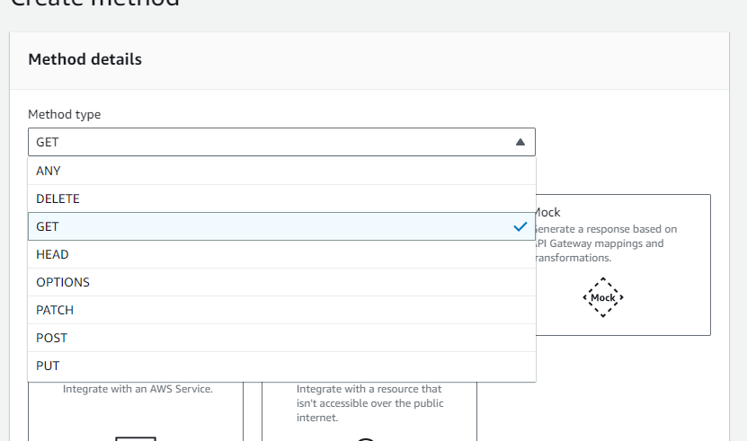

11. API Gateway will present possible integrations; choose "Mock" and click <kbd>Create Method</kbd>.

    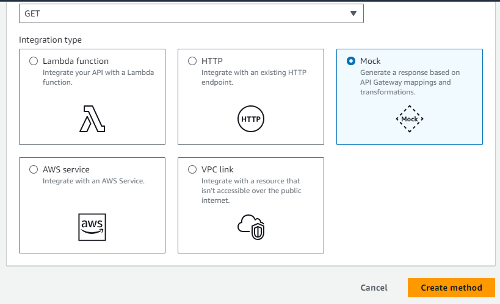

12. Go to "Integration Response" and click on it.

    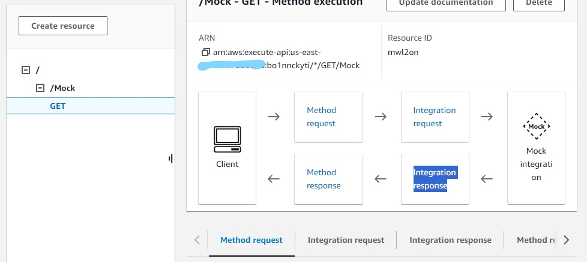
	
13. Click on "Edit"

	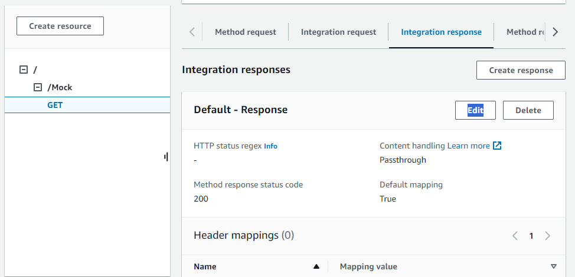

14. Navigate to Mapping Templates, and set the *Content-Type* to `application/json`.

15. In the template section, enter the following (modify the message as needed):

    ```bash
    {
        "statusCode": 200,
        "message": "This response is mocking you"
    }
    ```

    Click <kbd>Save</kbd>.

    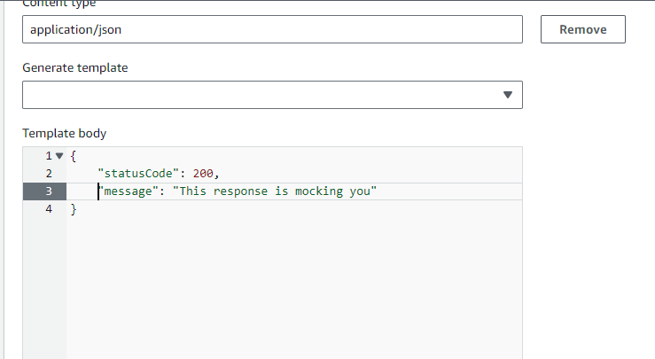

16. Click <kbd>Save</kbd> on the method response.

17. Now, set up the Lambda integration. Go back to the *root* (`/`) resource.

    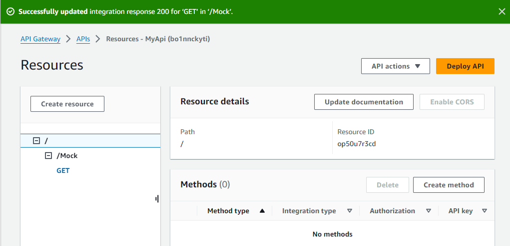

18. Click <kbd>Actions</kbd> and then <kbd>Create Resource</kbd>.

19. Name the resource "Lambda," and keep the Resource Path as "/lambda."

20. Click <kbd>Create Resource</kbd>.

21. Click on <kbd>Create Method</kbd>. This will also be a "GET."

    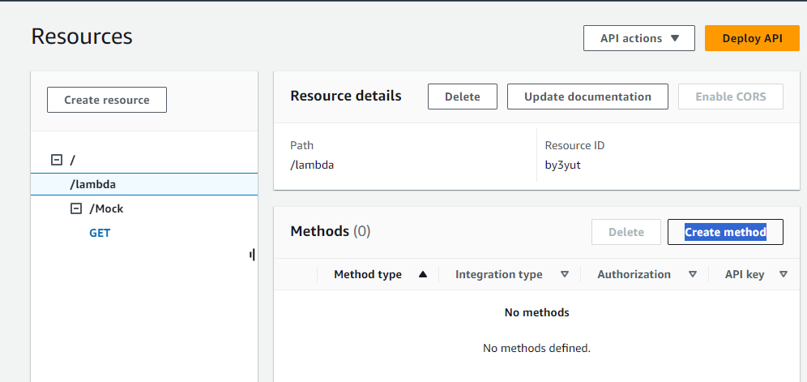

22. Set the "Integration type" to "Lambda function" on the next page.

    Enable "Use Lambda Proxy integration."

    Select the Lambda function you created earlier.

    Leave all other options unchanged and click <kbd>Create Method</kbd>.

    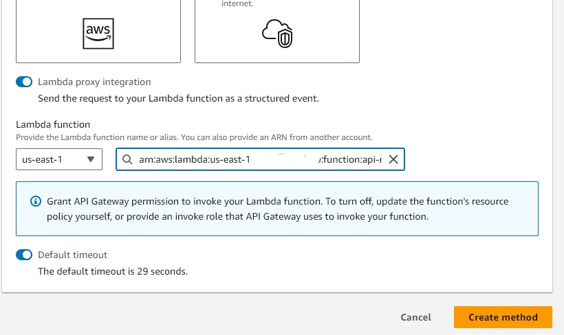

23. A popup will appear, informing you that you are granting API Gateway permission to invoke your Lambda function. Click <kbd>OK</kbd> to proceed.

24. Now, set up another resource for SNS (Simple Notification Service).

    a. Head to the IAM Console: [IAM Console](https://us-east-1.console.aws.amazon.com/iamv2/home?region=ap-southeast-2#/roles).

    b. Navigate to the Roles page and click <kbd>Create Role</kbd>.

    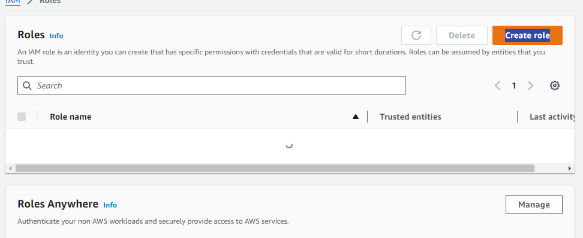

    c. Under "Trusted entity," select "AWS Service," and choose API Gateway from the drop-down. Make sure to select the radio button for "API Gateway" as well.

    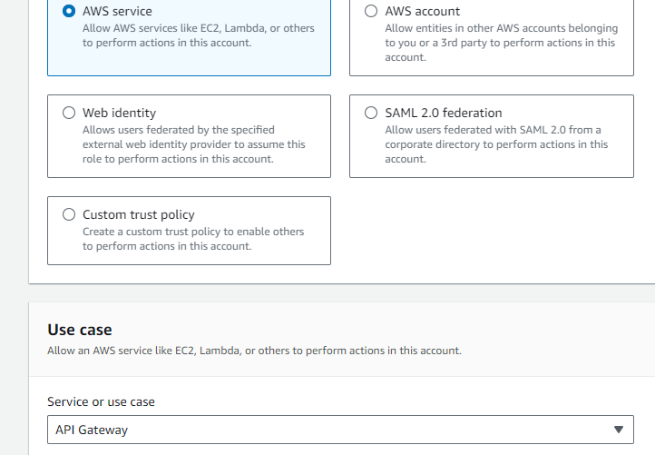

    d. Click <kbd>Next</kbd>.

    e. On the Permissions page, click <kbd>Next</kbd>.

    f. Set the role name to "api-gw-sns-role" and click <kbd>Create role</kbd>.

    g. Access the role you just created.

    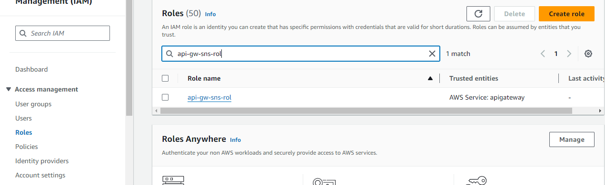

    h. Click on <kbd>Add permissions</kbd> and then <kbd>Create inline policy</kbd>.

    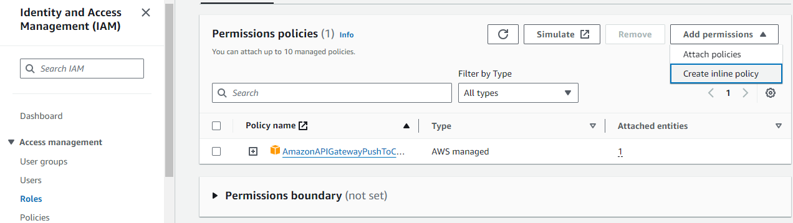

    i. In the JSON tab, enter the following policy:

    ```bash
    {
        "Version": "2012-10-17",
        "Statement": [
            {
                "Effect": "Allow",
                "Action": "sns:Publish",
                "Resource": "*"
            }
        ]
    }
    ```

    j. Click <kbd>Next</kbd>.

    k. Under "Policy Details," set the name to "SnsPublish" and click <kbd>Create policy</kbd>.

    l. On the summary page, copy the ARN of the role you just created; you'll need it for the next step.

    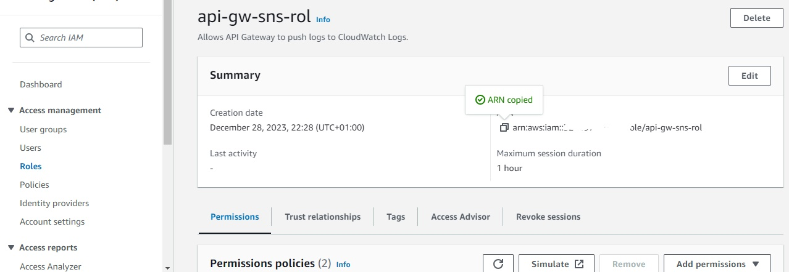

24. Return to the API Gateway console: [API Gateway Console](https://us-east-1.console.aws.amazon.com/apigateway/main/apis?region=us-east-1).

25. Go back to your REST API and navigate to the *root* resource.

    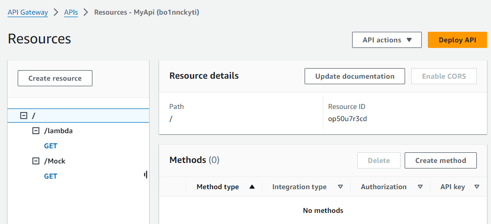

26. Click on <kbd>Create Resource</kbd>.

    a. Set the resource name to "SNS" and leave the Resource Path as "/sns".

    b. Click <kbd>Create Resource</kbd>.

27. Click on <kbd>Create Method</kbd>.

    a. This time, choose "POST."

    b. Set the "Integration type" to "AWS Service."

    c. Set the AWS Region to the same region as your API/SNS (e.g., us-east-1).

    d. Set the AWS Service to "Simple Notification Service (SNS)."

    e. Leave the AWS Subdomain blank.

    f. Set the HTTP method to POST.

    g. Leave the Action Type as "Use action name."

    h. Set the "Action" to "Publish."

    i. In the Execution Role field, enter the ARN of the IAM role created for SNS.

    j. Leave the rest of the form unchanged and click <kbd>Create Method</kbd>.

28. To pass messages through API Gateway to the AWS service, use Query Strings. Go to the "/sns" resource and the "POST" method, then click "Method Request."

    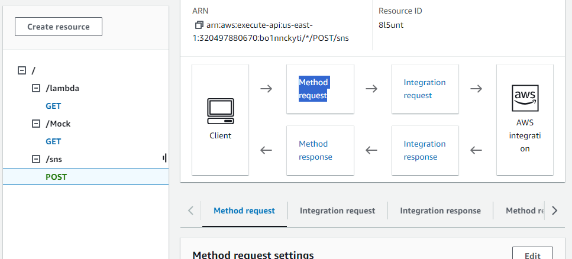

29. Click on "Edit, "Under "URL Query String Parameters," click "Add query string" and enter "TopicArn."

    a. Click "Add query string" again and enter "Message". Click on "Save".

    b. Your query string should look like this:

    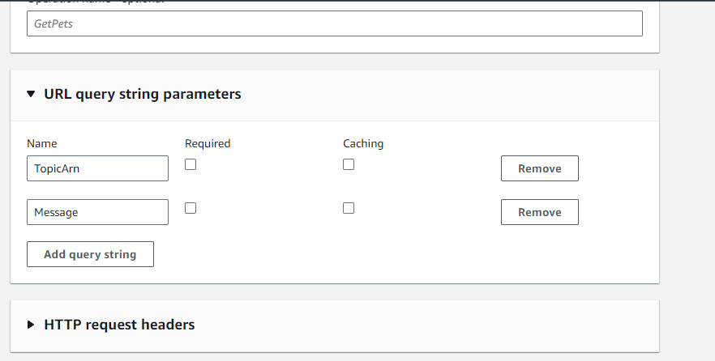

30. Go back to the "/sns" resource and the "POST" method, then click "Integration Request."

    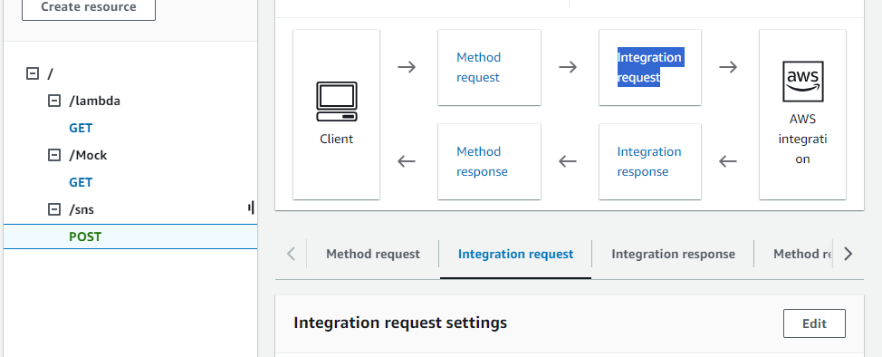

31. Click on "Edit, under "URL Query String Parameters," click "Add query string."

    a. Set the Name to "Message" and the Mapped from to `method.request.querystring.Message`.

    b. Click "Add query string" again.

    c. Set the Name to "TopicArn" and the Mapped from to `method.request.querystring.TopicArn`.

    d. Click the tick to save.

32. Now, Deploy the API.

    a. Click on <kbd>Deploy API</kbd> at the right corner.

    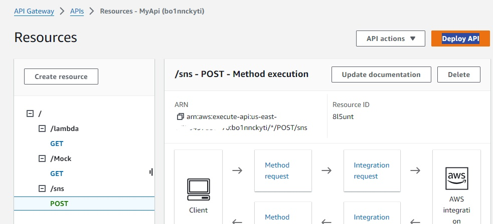

    b. In the pop-up window, set the "Deployment stage" to "[New Stage]" and the "Stage name" to "v1."

    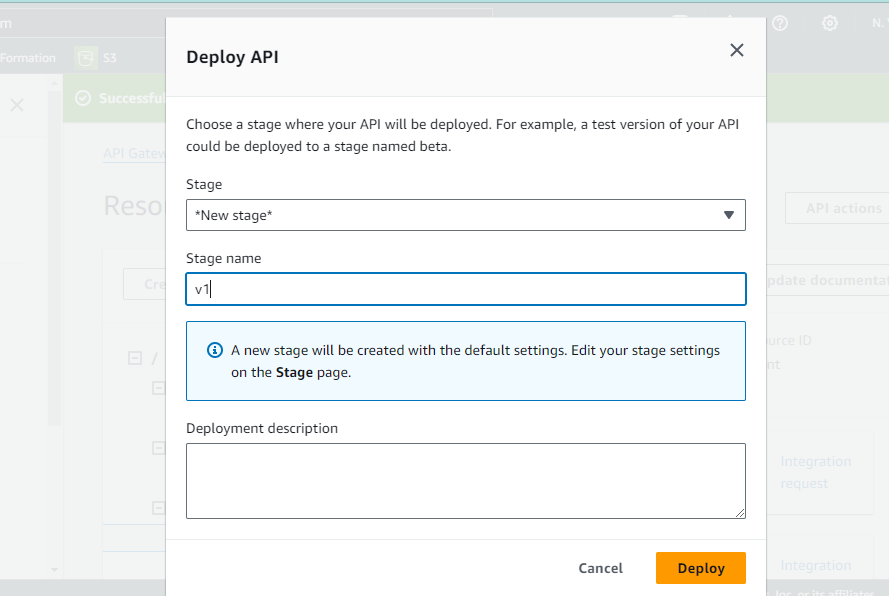

    c. Click <kbd>Deploy</kbd>.

33. Once done, you'll be directed to the Stage Editor page. You will see your Invoke URL.

    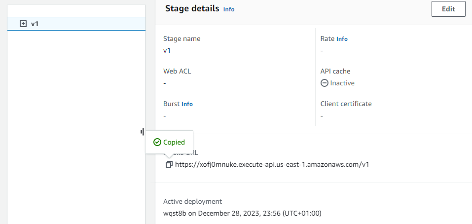

34. Copy the API URL for the next steps.

## Stage 4 - API Testing Procedures

To ensure the robust functionality of the API, comprehensive testing of Lambda, Mock, and SNS resources is imperative. Follow the steps outlined below to validate the integrity and responsiveness of each endpoint.

### Mock Resource

1. Access the API URL in your browser.
2. Append "/mock" to the URL.
3. Verify the expected response, as configured earlier.

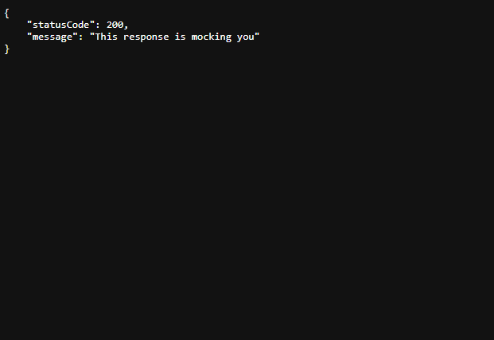

The JSON output facilitates seamless integration with programming languages, allowing for easy interpretation of essential data such as "statusCode" and "message" values.

### Lambda Resource

1. Access the "/lambda" endpoint in your browser.
2. Observe the function response, typically representing your IP address.

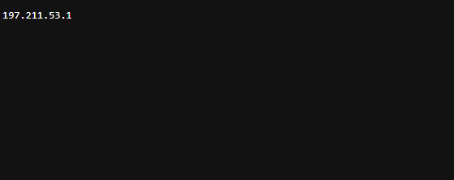

### SNS Resource

Testing the SNS endpoint involves distinct approaches due to browser limitations on non-GET requests.

#### Command Line

For command-line enthusiasts:

```bash
curl -X POST -G -d 'TopicArn=arn:aws:sns:REGION:ACCOUNT-ID:API-Messages' -d 'Message=Hello!'  YOUR_API_GATEWAY_URL/v1/sns
```

*Note:* If your message includes spaces, replace them with a "+", as query parameters are URL encoded.

#### GUI (AWS Console)

1. Navigate to the API Gateway console.
2. Access the testing page and input the following under "Query Strings":

```bash
TopicArn=arn:aws:sns:REGION:ACCOUNT-ID:API-Messages&Message=APIs+are+fun
```

3. Replace the TopicArn with your SNS Topic ARN and customize the message.
4. Click <kbd>Test</kbd>.


#### GUI (Postman)

Utilize Postman, a powerful API testing tool:

1. Open a new tab in Postman.
2. Set the method to POST and input your API Gateway URL.
3. Enter the two Query Parameters:

- `TopicArn`: ARN of your SNS topic.
- `Message`: The message for the topic.

4. Click <kbd>Send</kbd>.

Whichever method you choose, expect to receive an SNS email containing the specified message.


By rigorously testing each aspect of the API, you ensure its reliability and functionality across various scenarios.

## Stage 5: Cleanup Procedures

To ensure the seamless removal of resources associated with the project, follow the steps outlined below:

### 1. API Gateway Cleanup:

Access the API Gateway console [here](https://us-east-1.console.aws.amazon.com/apigateway/main/apis?region=us-east-1).

1. Choose the relevant API.
2. Click on <kbd>Actions</kbd> and select <kbd>Delete</kbd>. Type "Confirm" to delete.

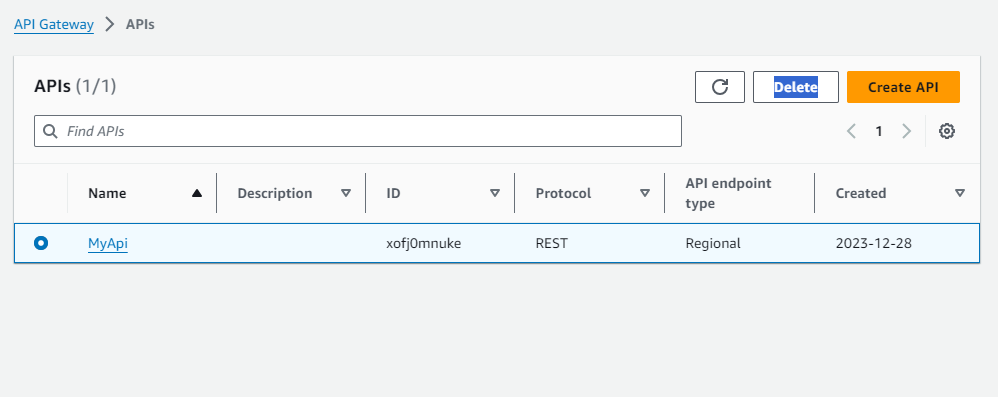

### 2. SNS Cleanup:

Visit the SNS console [here](https://us-east-1.console.aws.amazon.com/sns/v3/home?region=us-east-1#/topics).

1. Navigate to *Topics*.
2. Select the desired Topic.
3. Click on <kbd>Delete</kbd>.
4. In the confirmation box, input "delete me" and click <kbd>Delete</kbd>.

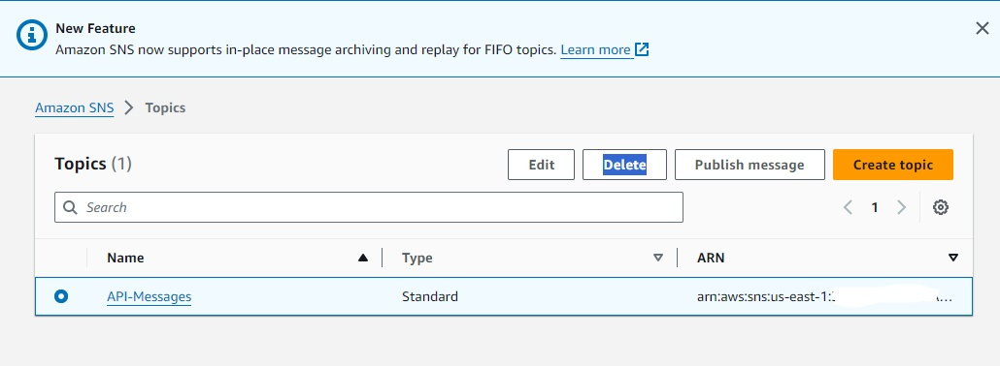

5. Go to *Subscriptions*.
6. Select the Subscription related to your email.
7. Click on <kbd>Delete</kbd>.

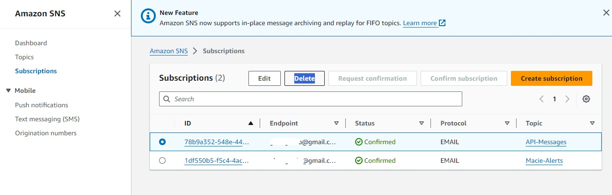

### 3. IAM Cleanup:

Access the IAM console [here](https://us-east-1.console.aws.amazon.com/iamv2/home?region=ap-southeast-2#/roles).

1. Under *Roles*, search for "api-gw-sns-role".
2. Select the identified role.
3. Click on <kbd>Delete</kbd>.
4. Type "api-gw-sns-role" into the confirmation field and click <kbd>Delete</kbd>.

### 4. Lambda Cleanup:

Navigate to the Lambda console [here](https://us-east-1.console.aws.amazon.com/lambda/home?region=us-east-1#/functions).

1. Select the relevant function.
2. Click on <kbd>Actions</kbd> and choose <kbd>Delete</kbd>.
3. Enter "delete" in the confirmation window and click <kbd>Delete</kbd>.

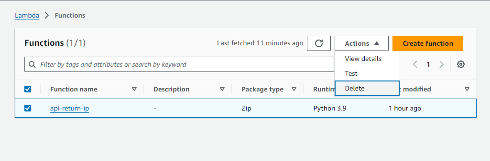

### 5. CloudWatch Logs Cleanup:

Access the CloudWatch Logs console [here](https://us-east-1.console.aws.amazon.com/cloudwatch/home?region=us-east-1#logsV2:log-groups).

1. Search for the "api-return-ip” Log Group.
2. Select the log group.
3. Click on <kbd>Actions</kbd> and select <kbd>Delete</kbd>.
4. In the confirmation popup, click <kbd>Delete</kbd>.

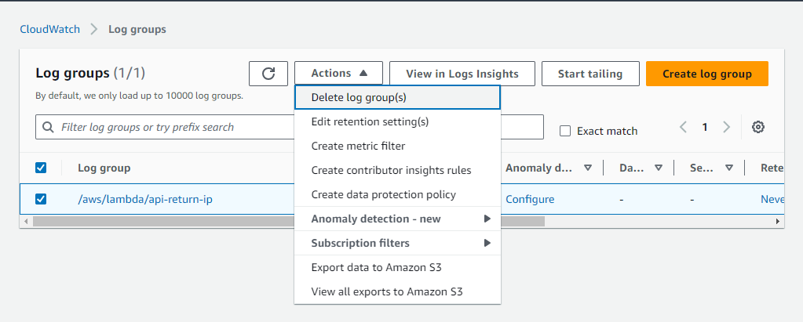

By following these steps meticulously, you will successfully clean up all relevant resources associated with the project.